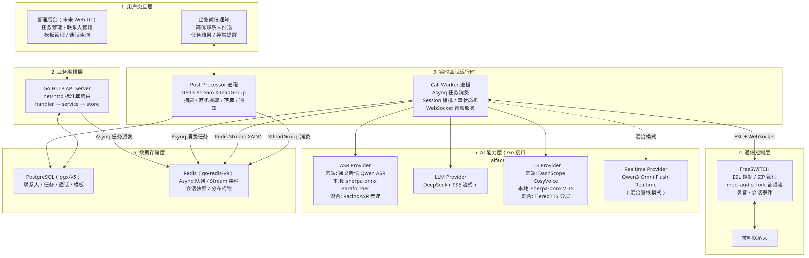
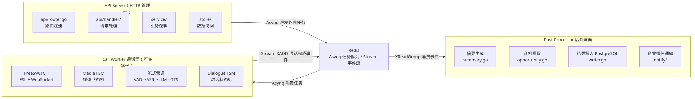
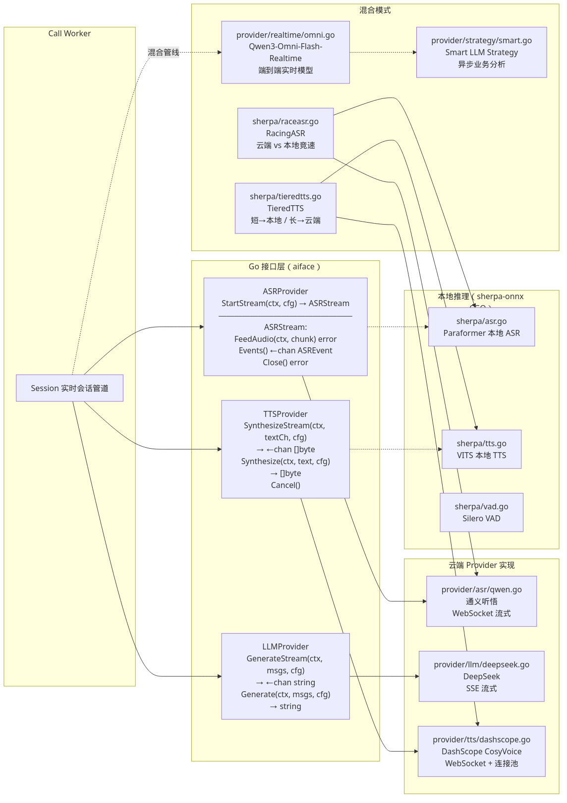

# 02 - 总体架构概览

---

## 目录

1. [总体架构概览](#1-总体架构概览)
2. [三类进程架构](#2-三类进程架构)
3. [用户交互层](#3-用户交互层)
4. [业务编排层](#4-业务编排层)
5. [AI能力层 — 流式Provider架构](#5-ai能力层--流式provider架构)
6. [数据存储层](#6-数据存储层)

---

## 1. 总体架构概览

系统采用**分层架构**设计，将关注点清晰隔离，同时在关键路径上引入**进程分离**，确保实时音频处理不受管理面操作的影响。

### 1.1 六层架构

整体系统由以下六层组成：

| 层级 | 名称 | 核心职责 |
|------|------|----------|
| L1 | **用户交互层** | 管理后台（Web UI，未来）+ 企业微信通知 |
| L2 | **业务编排层** | Go HTTP API Server（net/http），任务/联系人/模板/通话 CRUD |
| L3 | **实时会话运行时** | Call Worker（Asynq 任务消费 + 实时通话）+ Post-Processor（Redis Stream 消费） |
| L4 | **通信控制层** | FreeSWITCH — 外呼发起、SIP 管理、ESL 控制、音频收发 |
| L5 | **AI 能力层** | Go 接口抽象（aiface），通义听悟 ASR、DeepSeek LLM、DashScope TTS，sherpa-onnx 本地推理 |
| L6 | **数据存储层** | PostgreSQL（pgx/v5）+ Redis（go-redis/v9） |

### 1.2 架构总览图



> 图注：对应 Mermaid 源文件 `diagrams/02-01-overall-architecture.mmd`

### 1.3 各层交互要点

**L1 → L2（用户交互层 → 业务编排层）**

- 管理后台通过 HTTP API 完成任务创建、名单导入、模板管理、结果查询等操作。
- 企业微信通知由 Post-Processor 中的 `notify/` 包推送高优联系人、任务完成、异常提醒等通知。

**L2 → L3（业务编排层 → 实时会话运行时）**

- API Server 将外呼任务通过 **Asynq 任务队列**（基于 Redis）派发给 Call Worker。
- Call Worker 消费 Asynq 任务后，按照领域配置驱动实时会话。

**L3 → L4（实时会话运行时 → 通信控制层）**

- Call Worker 通过 **ESL（Event Socket Library）** 与 FreeSWITCH 交互，控制外呼发起和通话事件。
- 音频流通过 **WebSocket** 双向传输：FreeSWITCH 的 `mod_audio_fork` 将 RTP 音频帧推送至 Call Worker 内置的 WebSocket 服务端。

**L3 → L5（实时会话运行时 → AI 能力层）**

- Call Worker 中的 Session 将音频帧实时推送至 ASR Provider，获取流式识别结果。
- 识别结果送入 LLM Provider 进行流式推理，生成回复 token 流。
- Token 流实时送入 TTS Provider 进行流式语音合成，生成音频 chunk 回传给 FreeSWITCH 播放。
- 支持两种管线模式：经典模式（ASR→LLM→TTS 分步流式）和混合模式（Qwen3-Omni-Flash-Realtime 端到端）。

**L3 → L6（实时会话运行时 → 数据存储层）**

- 通话完成后，Call Worker 将完成事件通过 **Redis Stream**（XADD）推入事件流。
- Post-Processor 通过 **XReadGroup** 消费事件，执行摘要生成、商机提取、结果落库、通知推送。

**L2 ↔ L6（业务编排层 ↔ 数据存储层）**

- API Server 通过 `internal/store/` 层直接读写 PostgreSQL（pgx/v5），完成联系人、任务、模板等数据的 CRUD。

### 1.4 关键设计原则

1. **实时与管理分离** — 实时音频处理（Call Worker）与管理面（API Server）运行在不同进程中，避免 HTTP 请求抖动影响通话质量。
2. **流式优先** — AI 能力层全部采用流式接口，减少首字延迟，提升对话自然度。
3. **双状态机** — Media FSM（控制何时说话）与 Dialogue FSM（控制说什么）分离，通过 Session 协调，降低耦合。
4. **异步后处理** — 通话完成后的摘要生成、商机提取、通知推送等重操作异步完成，不阻塞通话资源。
5. **Provider 可替换** — ASR / LLM / TTS 均通过 Go 接口（`aiface`）抽象，云端与本地推理可通过配置切换。
6. **安全防护链** — `guard/` 包提供 Token/时间预算、回复校验、内容安全、跑题检测等多层防护。
7. **韧性设计** — `resilience/` 包提供熔断器、重试、降级回退等容错原语。

---

## 2. 三类进程架构

系统拆分为**三类独立进程**，每类进程有不同的运行特征和资源需求。

### 2.1 进程架构总览



> 图注：对应 Mermaid 源文件 `diagrams/02-02-process-architecture.mmd`

### 2.2 API Server（管理面）

**入口：** `cmd/clarion/`

**定位：** 处理所有非实时的管理操作，面向运营人员和系统管理员。

**核心职责：**

- **任务 CRUD** — 创建、查询、暂停、恢复、取消外呼任务
- **联系人管理** — 联系人导入与管理
- **模板管理** — 场景模板的创建与维护
- **通话查询** — 通话记录、摘要、录音的查询

**Go 包结构：**

| 包 | 职责 |
|------|------|
| `api/router.go` | 路由注册，Go 1.22+ 标准库 `net/http` 路由 |
| `api/handler/` | HTTP Handler，请求解析与响应构造 |
| `api/schema/` | 请求/响应 JSON Schema 定义 |
| `api/middleware.go` | 中间件：日志、Recovery |
| `service/` | 业务逻辑层 |
| `store/` | 数据访问层（PostgreSQL via pgx/v5） |

**运行特征：**

| 特性 | 说明 |
|------|------|
| 协议 | HTTP/HTTPS |
| 延迟要求 | 常规 Web 应用级别（百毫秒） |
| 并发模型 | Go net/http，goroutine per request |
| 实例数 | 单实例 |
| 重启影响 | 不影响进行中的通话 |
| 二进制 | `bin/clarion` |

### 2.3 Call Worker（通话面）

**入口：** `cmd/worker/`

**定位：** 处理实时音频通话，管理通话的完整生命周期。

**核心职责：**

- **Asynq 任务消费** — 从 Asynq 任务队列消费外呼任务
- **FreeSWITCH ESL 连接** — 通过 ESL 发起呼叫、控制通话
- **WebSocket 音频服务** — 内置 WebSocket Server 接收 FreeSWITCH 推送的音频流
- **Session 编排** — 驱动单通电话的完整生命周期（`call/session.go`）
- **双状态机** — Media FSM 管理媒体状态，Dialogue FSM 管理对话流程
- **流式管道** — 经典模式（VAD → ASR → LLM → TTS）或混合模式（Qwen3-Omni-Flash-Realtime）

**Go 包结构：**

| 包 | 职责 |
|------|------|
| `call/worker.go` | Worker 结构体，Asynq Handler，WebSocket Server |
| `call/session.go` | Session 编排主体 |
| `call/session_audio.go` | 音频收发 |
| `call/session_dialogue.go` | 对话流程 |
| `call/session_esl.go` | FreeSWITCH ESL 控制 |
| `call/session_tts.go` | TTS 合成与播放 |
| `call/session_filler.go` | 等待期间填充音频 |
| `call/session_hybrid.go` | Omni-Realtime 混合模式 |
| `call/session_speculative.go` | ASR 稳定时提前推测 LLM |

**运行特征：**

| 特性 | 说明 |
|------|------|
| 延迟要求 | 严格实时（毫秒级） |
| 并发模型 | goroutine + channel |
| 任务消费 | Asynq（基于 Redis） |
| 管线模式 | classic（ASR→LLM→TTS）/ hybrid（Omni-Realtime） |
| 实例数 | 可多实例，每实例处理 N 路并发通话 |
| 二进制 | `bin/clarion-worker` |

### 2.4 Post-Processor（后处理面）

**入口：** `cmd/postprocessor/`

**定位：** 异步处理通话完成后的后续操作，不占用实时资源。

**核心职责：**

- **事件消费** — 通过 Redis Stream XReadGroup 消费通话完成事件
- **摘要生成** — 基于通话记录调用 LLM 生成结构化摘要（`postprocess/summary.go`）
- **商机提取** — 从对话内容提取业务机会（`postprocess/opportunity.go`）
- **结果落库** — 将通话结果持久化到 PostgreSQL（`postprocess/writer.go`）
- **企业微信通知** — 针对高优联系人或异常情况推送通知（`notify/`）

**Go 包结构：**

| 包 | 职责 |
|------|------|
| `postprocess/worker.go` | Redis Stream 事件消费主循环 |
| `postprocess/summary.go` | LLM 摘要生成 |
| `postprocess/opportunity.go` | 商机提取 |
| `postprocess/writer.go` | PostgreSQL 写入 |
| `notify/` | 企业微信通知 |

**运行特征：**

| 特性 | 说明 |
|------|------|
| 延迟要求 | 无严格要求（秒级到分钟级可接受） |
| 并发模型 | 事件驱动，Redis Stream XReadGroup |
| 实例数 | 单实例 |
| 重启影响 | 不影响通话，仅暂时延迟后处理 |
| 幂等性 | 所有操作必须幂等，支持重试 |
| 二进制 | `bin/clarion-postprocessor` |

### 2.5 三类进程协作流程

1. **API Server** 创建外呼任务，将任务信息写入 PostgreSQL，同时通过 **Asynq** 将任务派发到 Redis。
2. **Call Worker** 消费 Asynq 任务，通过 FreeSWITCH ESL 发起呼叫，启动 WebSocket 音频服务，驱动 Session 完成实时对话。
3. 通话完成后，**Call Worker** 将通话完成事件通过 **Redis Stream XADD** 推入事件流。
4. **Post-Processor** 通过 **Redis Stream XReadGroup** 消费事件，执行摘要生成、商机提取、数据落库、通知推送等操作。

### 2.6 进程间通信机制

三类进程之间通过 **Redis** 进行松耦合通信：

| 通信场景 | 机制 | 说明 |
|----------|------|------|
| 任务派发 | **Asynq 任务队列** | API Server 入队，Call Worker 消费 |
| 通话完成事件 | **Redis Stream**（XADD/XREADGROUP） | Call Worker XADD，Post-Processor XReadGroup |
| 会话快照 | **Redis String + TTL** | 会话恢复用，带过期时间 |
| 分布式锁 | **String + SETNX** | 防止重复外呼 |

---

## 3. 用户交互层

### 3.1 管理后台

管理后台是运营人员操作系统的主要入口。当前阶段以 API 为主，Web UI 为未来规划。

**核心功能：**

- **联系人管理** — 联系人信息维护
- **任务管理** — 创建外呼任务，配置外呼参数
- **模板管理** — 创建和编辑场景模板
- **通话查询** — 查看通话记录、AI 摘要

### 3.2 企业微信通知

通过 `internal/notify/` 包集成企业微信机器人，由 Post-Processor 负责推送。

**通知场景：**

- **高优联系人推送** — 通话中识别到高意向联系人时，推送给对应销售/客服
- **任务完成通知** — 外呼任务批次完成后，推送汇总数据
- **异常告警** — 系统异常实时告警

---

## 4. 业务编排层

### 4.1 API Server 架构

业务编排运行在 API Server 进程中，基于 Go 标准库 `net/http` 构建，无第三方框架。

**请求处理链路：**

```
HTTP Request → middleware.go（日志/Recovery）→ router.go（路由分发）→ handler/（请求处理）→ service/（业务逻辑）→ store/（数据访问）→ PostgreSQL
```

**内核管理的实体：**

| 实体 | 说明 |
|------|------|
| 联系人（Contact） | 被叫信息，含电话、姓名、自定义字段 |
| 外呼任务（Task） | 一批联系人 + 场景模板 + 调度配置 |
| 场景模板（Template） | 定义对话流程的配置 |
| 通话记录（Call） | 一次通话的完整信息 |

### 4.2 对话引擎

对话引擎运行在 Call Worker 中，采用双状态机架构：

- **Media FSM**（`engine/media/fsm.go`）：IDLE → DIALING → RINGING → AMD → BOT_SPEAKING ↔ USER_SPEAKING → HANGUP
- **Dialogue FSM**（`engine/dialogue/`）：Opening → Qualification → InformationGathering → ObjectionHandling → NextAction → Closing

两个 FSM 独立运行，通过 Session 协调。Media FSM 控制「何时说话」，Dialogue FSM 控制「说什么」。

---

## 5. AI能力层 — 流式Provider架构

### 5.1 设计理念

AI 能力层采用**全链路流式处理**，通过 Sonata 核心库定义的 Go 接口（`engine/aiface/`）实现统一抽象。

**为什么必须流式：**

| 指标 | 批次模式 | 流式模式 |
|------|----------|----------|
| ASR 延迟 | 等待说完 → 整句识别 | 边说边识别，实时出部分结果 |
| LLM 首 token 延迟 | 等待完整输入 → 完整输出 | 流式输入 → 流式输出 |
| TTS 首音频延迟 | 等待完整文本 → 完整合成 | 收到首批 token 即开始合成 |
| 端到端延迟 | 各环节延迟累加 | 各环节流水线并行，大幅降低 |
| 用户体感 | 长时间沉默后突然回复 | 自然、连贯的对话节奏 |

### 5.2 Provider 架构图



> 图注：对应 Mermaid 源文件 `diagrams/02-03-provider-architecture.mmd`

### 5.3 Go 接口定义（aiface）

所有 Provider 必须实现 Sonata 定义的 Go 接口，Call Worker 通过这些接口与 AI 服务交互。

#### 5.3.1 ASR Provider 接口

```go
type ASRProvider interface {
    StartStream(ctx context.Context, cfg ASRConfig) (ASRStream, error)
}

type ASRStream interface {
    FeedAudio(ctx context.Context, chunk []byte) error
    Events() <-chan ASREvent
    Close() error
}
```

**关键设计点：**

- `FeedAudio` 持续接收音频帧，无需等待用户说完。
- `Events()` 返回 channel，异步推送 partial/final/endpoint 等事件。
- 支持 `RacingASR` 模式：本地 sherpa-onnx Paraformer 与云端通义听悟竞速，谁先返回用谁。

#### 5.3.2 LLM Provider 接口

```go
type LLMProvider interface {
    GenerateStream(ctx context.Context, messages []Message, cfg LLMConfig) (<-chan string, error)
    Generate(ctx context.Context, messages []Message, cfg LLMConfig) (string, error)
}
```

**关键设计点：**

- `GenerateStream` 返回 `<-chan string`，每个 token 立即发送，无需等待完整回复。
- `Generate` 为同步接口，用于非实时场景（如后处理摘要）。
- 支持 DeepSeek SSE 流式协议。

#### 5.3.3 TTS Provider 接口

```go
type TTSProvider interface {
    SynthesizeStream(ctx context.Context, textCh <-chan string, cfg TTSConfig) (<-chan []byte, error)
    Synthesize(ctx context.Context, text string, cfg TTSConfig) ([]byte, error)
    Cancel()
}
```

**关键设计点：**

- `SynthesizeStream` 接收 token 流作为输入，不需要完整文本，返回音频 chunk 流。
- `Cancel()` 支持即时取消，应对用户打断场景。
- DashScope 实现内置 WebSocket **连接池**（`provider/tts/pool.go`），避免每次合成都建立新连接。
- 支持 `TieredTTS` 模式：短文本走 sherpa-onnx VITS 本地合成（更低延迟），长文本走 DashScope 云端合成。

### 5.4 Provider 实现

| 能力 | 云端实现 | 本地备选（sherpa-onnx） | 混合模式 |
|------|----------|------------------------|----------|
| ASR | **通义听悟**（WebSocket 流式）`provider/asr/qwen.go` | Paraformer `sherpa/asr.go` | RacingASR `sherpa/raceasr.go` |
| LLM | **DeepSeek**（SSE 流式）`provider/llm/deepseek.go` | — | Smart Strategy `provider/strategy/smart.go` |
| TTS | **DashScope CosyVoice**（WebSocket + 连接池）`provider/tts/dashscope.go` | VITS `sherpa/tts.go` | TieredTTS `sherpa/tieredtts.go` |
| VAD | — | **Silero** `sherpa/vad.go` | — |
| Realtime | **Qwen3-Omni-Flash-Realtime** `provider/realtime/omni.go` | — | 混合管线模式 |

**sherpa-onnx 本地推理：**

Sonata 核心库中的 `sherpa/` 包通过 CGO 绑定 sherpa-onnx，提供本地推理能力：

- `sherpa/asr.go` — Paraformer 本地 ASR
- `sherpa/tts.go` — VITS 本地 TTS
- `sherpa/vad.go` — Silero VAD
- `sherpa/speaker.go` — 说话人嵌入
- `sherpa/raceasr.go` — 云端/本地 ASR 竞速
- `sherpa/tieredtts.go` — 分层 TTS（短→本地，长→云端）

### 5.5 管线模式

Call Worker 支持两种管线模式，通过 TOML 配置切换：

**经典模式（classic）：**

```
用户语音 → VAD → ASR → LLM → TTS → FreeSWITCH 播放
```

各环节通过 Go channel 流式串联，支持推测式 LLM 调用（ASR 结果稳定时提前推理）。

**混合模式（hybrid）：**

```
用户语音 → Qwen3-Omni-Flash-Realtime（端到端）→ FreeSWITCH 播放
                                          ↘ Smart Strategy（异步业务分析）
```

Realtime 模型处理实时对话，Smart Strategy 异步运行业务分析（商机识别、意图判断等）。

### 5.6 配置

Provider 选择通过 TOML 配置文件（`clarion.toml`）指定，支持环境变量覆盖（`CLARION_{SECTION}_{KEY}`）：

- 默认 ASR：`qwen`（通义听悟）
- 默认 LLM：`deepseek`
- 默认 TTS：`dashscope`（CosyVoice）
- 默认管线：`classic`

---

## 6. 数据存储层

### 6.1 存储技术选型

| 存储 | 技术 | 驱动 | 用途 |
|------|------|------|------|
| 关系数据库 | PostgreSQL | pgx/v5 | 结构化业务数据的持久存储 |
| 内存数据库 | Redis | go-redis/v9 | 任务队列、事件流、会话快照、锁 |

### 6.2 PostgreSQL

承担系统的核心业务数据存储，通过 `internal/store/` 包访问：

- **联系人数据** — 电话、姓名、自定义字段
- **任务数据** — 任务配置、状态、调度信息
- **通话记录** — 通话时长、接通状态、对话文本、摘要、商机
- **模板数据** — 场景模板

> 详细的数据模型设计请参见文档 `06-数据模型设计`。

### 6.3 Redis

在系统中承担多种实时职责：

| 用途 | 机制 | 说明 |
|------|------|------|
| 外呼任务队列 | **Asynq** | API Server 入队，Call Worker 消费 |
| 通话完成事件流 | **Stream（XADD/XREADGROUP）** | Call Worker 发布，Post-Processor 消费 |
| 会话快照 | **String + TTL** | 通话中的会话状态，用于恢复 |
| 分布式锁 | **String + SETNX** | 防止同一联系人被重复外呼 |

### 6.4 数据流向总结

```
API Server 写入:     PostgreSQL ← 联系人/任务/模板
任务派发:            Asynq（Redis）← 外呼任务
实时通话:            Redis String ← 会话快照（临时，带 TTL）
通话完成:            Redis Stream ← 完成事件
后处理写入:          PostgreSQL ← 通话记录/摘要/商机
后处理通知:          企业微信 ← 高优联系人推送
```

> 详细的数据模型、表结构、索引策略请参见文档 `06-数据模型设计`。

---

## 附录

### A. 相关文档

| 文档编号 | 标题 | 说明 |
|----------|------|------|
| 01 | 需求与范围 | 项目背景、MVP 范围定义 |
| 03 | 实时会话运行时 | Call Worker 详细设计 |
| 04 | 通信控制层 | FreeSWITCH 集成方案 |
| 05 | 对话引擎 | 双状态机、对话流程 |
| 06 | 数据模型设计 | PostgreSQL 表结构、Redis 键设计 |
| 07 | 部署与运维 | 部署方案、模块划分、可观测性 |

### B. Mermaid 源文件清单

| 文件 | 对应图片 | 说明 |
|------|----------|------|
| `diagrams/02-01-overall-architecture.mmd` | `images/02-01-overall-architecture.png` | 总体架构图 |
| `diagrams/02-02-process-architecture.mmd` | `images/02-02-process-architecture.png` | 三类进程架构图 |
| `diagrams/02-03-provider-architecture.mmd` | `images/02-03-provider-architecture.png` | AI Provider 架构图 |
