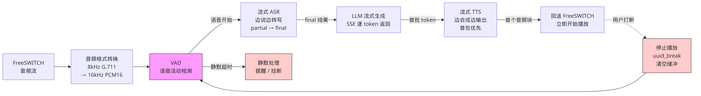
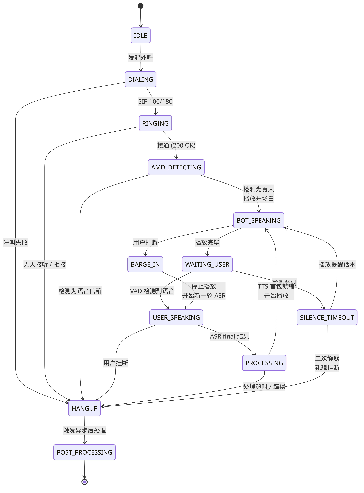

# 第三章 实时会话运行时

---

## 1. 为什么需要实时会话运行时

### 1.1 串行批处理模型的问题

如果采用**串行批处理模型**：

```
用户说完整句话 → 等待完整 ASR 结果 → 发送给 LLM 生成完整回复 → 完整文本送 TTS → 播放
```

这个流程的每一步都必须等上一步**完全结束**才能开始，导致端到端延迟高达 **3-5 秒**。在正常人类对话中，话轮切换间隔约 200-500ms，3 秒以上的沉默会让用户感到困惑、不耐烦，甚至直接挂断。

### 1.2 电话机器人不是"文本聊天 + 语音转接"

电话机器人的本质是一个**全双工实时语音系统**，而不是文本聊天系统加语音前后端。两者有根本区别：

| 维度 | 文本聊天 + 语音转接 | 全双工实时语音 |
|---|---|---|
| 音频流 | 单向、批处理 | 双向、持续流式 |
| 延迟容忍 | 秒级可接受 | > 1.5s 用户明显感知 |
| 打断 | 不存在 | 核心需求 |
| 并行处理 | 无 | ASR/LLM/TTS 管道并行 |
| 状态管理 | 请求-响应 | 持续状态机 |
| 异常处理 | 重试即可 | 必须实时降级 |

### 1.3 运行时层的职责

实时会话运行时是介于 SIP/媒体层与业务逻辑层之间的中间层，负责：

- **流式音频处理**：管理 ASR → LLM → TTS 的流式管道，确保首包延迟最小化
- **打断检测与处理**：用户说话时立即停止 AI 播放，切换到新一轮识别
- **超时管理**：静默超时、处理超时、通话时长保护
- **降级策略**：任何环节失败时自动降级到备用方案，保证通话不中断
- **媒体状态管理**：维护一个与业务状态机并行的媒体状态机

---

## 2. 流式处理管道



流式处理管道是实时会话运行时的核心，采用**流水线并行**：上一环节产出的第一个片段就立即传给下一环节，不等待完整结果。

### 2.1 延迟目标

| 环节 | 目标延迟 | 说明 |
|---|---|---|
| ASR 首字 | < 300ms | 从用户开始说话到获得第一个 partial 结果 |
| LLM 首 token | < 500ms | 从 ASR final 结果到 LLM 返回第一个 token |
| TTS 首包 | < 500ms | 从 LLM 首批 token 到 TTS 返回第一个音频块 |
| **端到端** | **< 1.5s** | **从用户说完话到 AI 开始说话的总延迟** |

> **关键指标**：端到端延迟 < 1.5 秒。这是用户体验的硬性要求，超过此值用户会感知到明显的"呆滞"。

### 2.2 管道详细流程

#### 第一步：音频采集与格式转换

```
FreeSWITCH 音频流 → Media Proxy → 格式转换
```

- FreeSWITCH 通过 WebSocket 或 ESL 将 RTP 音频流发送到 Media Proxy
- 音频格式转换：**8kHz G.711（μ-law/A-law）→ 16kHz PCM16 线性采样**
- 转换原因：电话网络使用 8kHz G.711 编码，但主流 ASR 引擎在 16kHz 下识别效果显著更好
- 转换方式：使用 libsamplerate 或 FFmpeg 进行高质量重采样

#### 第二步：VAD 持续检测

```
PCM16 音频帧 → VAD 引擎 → 事件（语音开始 / 语音结束 / 静默超时）
```

- VAD 对每一帧音频（通常 20-30ms 一帧）进行持续检测
- 产出三类事件：`SPEECH_START`、`SPEECH_END`、`SILENCE_TIMEOUT`
- VAD 独立于 ASR 运行，不依赖 ASR 返回结果
- 详见第 4 节

#### 第三步：流式 ASR

```
VAD SPEECH_START → 开启 ASR 会话
音频帧持续发送 → ASR 返回 partial 结果（边说边转写）
VAD SPEECH_END → ASR 返回 final 结果
```

- 使用流式 ASR 接口（如阿里云实时语音识别），建立长连接
- **Partial 结果**用于 UI 展示和提前预判，不触发 LLM
- **Final 结果**才触发下游 LLM 处理
- 每通电话维持一个 ASR 长连接，避免反复建连开销

#### 第四步：LLM 流式生成

```
ASR final 结果 → 规则引擎预处理 → LLM 流式调用（SSE）→ 逐 token 返回
```

- 使用 Server-Sent Events（SSE）接口调用 LLM
- LLM 逐 token 返回，不等待完整回复生成
- 规则引擎在 LLM 之前做快速匹配，命中关键意图可跳过 LLM 直接返回模板回复

#### 第五步：流式 TTS

```
LLM 首批 token（通常积累一句话）→ TTS 流式合成 → 音频块逐块返回
```

- **不等待 LLM 完整回复**，积累到第一个完整句子（句号、逗号、问号断句）即开始 TTS
- TTS 逐块返回音频数据（通常 200-400ms 一块）
- 第一块音频优先推送到播放端

#### 第六步：回送播放

```
TTS 首个音频块 → 格式转换（16kHz PCM16 → 8kHz G.711）→ FreeSWITCH → 用户听到
```

- 音频格式反向转换回电话网络格式
- 通过 ESL 的 `uuid_broadcast` 或 WebSocket 推送音频帧
- 后续音频块持续到达，实现边合成边播放

#### 并行处理

在整个管道运行过程中，以下处理持续并行执行：

- **回声抑制**：AI 播放音频时标记为 echo 期间，防止 ASR 误识别自身播放内容
- **打断检测**：BOT_SPEAKING 状态下 VAD 持续监听用户语音
- **超时监控**：每个环节独立计时，超时触发降级

### 2.3 流式 vs 批处理延迟对比

```
批处理模式：
  ASR 2s ──────→ LLM 2s ──────→ TTS 1s ──→  总延迟 ~5s
                                              ────────────→

流式模式：
  ASR 0.3s → LLM 0.5s → TTS 0.5s →  总延迟 ~1.3s
              ─overlap──  ─overlap─   ──────→
```

流式模式下各环节重叠执行，用户感知到的延迟大幅降低。

---

## 3. 媒体状态机



媒体状态机与业务状态机**并行运行**。业务状态机关注对话轮次和意图流转（如"已确认意向→已报价→已预约"），媒体状态机关注底层通话媒体层面的状态。

### 3.1 状态定义

| 状态 | 英文标识 | 说明 |
|---|---|---|
| 空闲 | `IDLE` | 通话未建立，等待调度 |
| 拨号中 | `DIALING` | 已发起 SIP INVITE，等待响应 |
| 振铃中 | `RINGING` | 收到 SIP 100/180，对方正在振铃 |
| 语音信箱检测 | `AMD_DETECTING` | 通话接通，前 2-3 秒检测是真人还是语音信箱 |
| AI 播放中 | `BOT_SPEAKING` | AI 正在播放 TTS 音频，可被打断 |
| 等待用户 | `WAITING_USER` | AI 播放完毕，VAD 正在监听，等待用户开口 |
| 用户说话中 | `USER_SPEAKING` | VAD 检测到用户语音，流式 ASR 进行中 |
| 处理中 | `PROCESSING` | ASR 返回 final 结果，LLM + 规则引擎正在生成回复 |
| 打断 | `BARGE_IN` | 用户在 AI 播放过程中开口打断 |
| 静默超时 | `SILENCE_TIMEOUT` | 等待用户时超过设定时间未检测到语音 |
| 挂断 | `HANGUP` | 通话结束（正常/异常/超时均进入此状态） |
| 异步后处理 | `POST_PROCESSING` | 通话结束后的异步任务（意向写入、录音存储等） |

### 3.2 状态转移规则

```
IDLE → DIALING
  触发：调度器发起外呼指令
  动作：通过 ESL 发送 originate 命令

DIALING → RINGING
  触发：收到 SIP 100 Trying 或 180 Ringing
  动作：启动振铃超时计时器（默认 30 秒）

DIALING → HANGUP
  触发：SIP 4xx/5xx 错误、网络超时
  动作：记录呼叫失败原因

RINGING → AMD_DETECTING
  触发：SIP 200 OK（对方接听）
  动作：启动 AMD 检测，开始录音

RINGING → HANGUP
  触发：振铃超时、SIP 486 Busy、603 Decline
  动作：记录未接听/拒接

AMD_DETECTING → BOT_SPEAKING
  触发：检测为真人（有自然停顿）
  动作：播放开场白（优先使用预合成音频）

AMD_DETECTING → HANGUP
  触发：检测为语音信箱（连续语音 > 4 秒）
  动作：标记 answer_type=voicemail，挂断

BOT_SPEAKING → WAITING_USER
  触发：TTS 音频播放完毕
  动作：启动静默超时计时器

BOT_SPEAKING → BARGE_IN
  触发：VAD 检测到用户语音能量超过打断阈值
  动作：停止播放，清空缓冲

WAITING_USER → USER_SPEAKING
  触发：VAD 检测到 SPEECH_START
  动作：开启流式 ASR 会话

WAITING_USER → SILENCE_TIMEOUT
  触发：静默超过设定时间（6-8 秒）
  动作：进入超时处理逻辑

USER_SPEAKING → PROCESSING
  触发：ASR 返回 final 结果
  动作：将文本送入 LLM + 规则引擎

USER_SPEAKING → HANGUP
  触发：检测到用户挂断（SIP BYE）
  动作：中止 ASR，进入后处理

PROCESSING → BOT_SPEAKING
  触发：TTS 首个音频块就绪
  动作：开始播放 AI 回复

PROCESSING → HANGUP
  触发：处理超时（> 5 秒）或服务错误
  动作：尝试降级，否则礼貌挂断

BARGE_IN → USER_SPEAKING
  触发：播放停止完成
  动作：丢弃旧 ASR 缓冲，开始新一轮流式 ASR

SILENCE_TIMEOUT → BOT_SPEAKING
  触发：首次静默超时
  动作：播放提醒话术（如"您好，请问还在吗？"）

SILENCE_TIMEOUT → HANGUP
  触发：二次静默超时
  动作：播放结束语并挂断

HANGUP → POST_PROCESSING
  触发：通话完全断开
  动作：触发异步后处理任务
```

### 3.3 媒体状态机与业务状态机的关系

```
┌─────────────────────────────────────┐
│         业务状态机（Dialog FSM）       │
│  开场 → 意向确认 → 报价 → 预约 → 结束  │
│         ↕ 事件交互 ↕                  │
│       媒体状态机（Media FSM）          │
│  IDLE → DIALING → ... → HANGUP       │
└─────────────────────────────────────┘
```

- 业务状态机决定"说什么"（内容决策）
- 媒体状态机决定"怎么说、何时说"（媒体控制）
- 两者通过事件总线解耦通信

---

## 4. VAD（语音活动检测）

### 4.1 VAD 的作用

VAD（Voice Activity Detection）是实时语音系统的基础组件，负责：

- **检测用户开始说话**：触发流式 ASR 启动
- **检测用户说完话**：触发 ASR 输出 final 结果，开始 LLM 处理
- **区分噪音与语音**：避免背景噪音触发误识别
- **辅助打断检测**：在 BOT_SPEAKING 状态下判断用户是否开口

### 4.2 技术选项对比

| 方案 | 优点 | 缺点 | 适用场景 |
|---|---|---|---|
| **Silero VAD** | 开源免费、轻量（纯 CPU）、准确率高 | 需要自行集成、维护 | 对 VAD 有定制需求 |
| **阿里云 ASR 内置 VAD** | 零开发量、与 ASR 深度集成、端点检测准确 | 依赖云服务、无法独立调参 | MVP 首选 |
| **FreeSWITCH mod_vad** | 在媒体层直接检测、延迟最低 | 功能简单、准确率一般 | 辅助/备用 |

### 4.3 MVP 建议

**MVP 阶段推荐使用阿里云 ASR 内置的端点检测（Endpoint Detection）**，原因：

1. **最省开发量**：阿里云实时语音识别 API 内置 VAD 功能，无需额外部署
2. **端点检测准确**：阿里云针对中文电话场景优化，能较好地判断用户说完话的时机
3. **参数可配**：可通过 `max_start_silence`、`max_end_silence` 等参数调整灵敏度

```json
{
  "asr_config": {
    "provider": "aliyun",
    "enable_intermediate_result": true,
    "enable_punctuation_prediction": true,
    "max_start_silence": 10000,
    "max_end_silence": 800
  }
}
```

> **注意**：即使使用阿里云内置 VAD，仍建议在 Media Proxy 层保留一个轻量 VAD（如 Silero）用于打断检测，因为打断检测对延迟要求更高。

### 4.4 静默超时策略

静默超时是 WAITING_USER 状态下的关键保护机制：

| 阶段 | 超时阈值 | 处理方式 |
|---|---|---|
| 首次静默 | 6-8 秒 | 播放提醒话术："您好，请问还在吗？" |
| 二次静默 | 15 秒 | 播放结束语并礼貌挂断："好的，后续如有需要可以随时联系我们，再见！" |
| 通话中累计静默 | 可配置 | 超过阈值标记为低质量通话 |

静默超时参数应**可配置**，不同场景（如催收 vs 营销）对静默容忍度不同。

---

## 5. 打断处理（Barge-in）

### 5.1 场景描述

打断（Barge-in）指 AI 正在播放 TTS 音频时，用户开始说话。这是电话对话中的高频场景：

- 用户已经理解了 AI 要说的内容，想直接回答
- 用户想纠正 AI 的理解偏差
- 用户不耐烦，想快速跳过

**如果不处理打断**，用户必须等 AI 说完整段话才能回应，体验极差。

### 5.2 检测方式

在 `BOT_SPEAKING` 状态下：

1. VAD 持续监听 FreeSWITCH 传入的音频流
2. 由于 AI 正在播放，音频流中包含回声（AI 自己的声音）
3. 需要区分回声和用户真实语音
4. **判断条件**：用户语音能量超过打断阈值，且持续时间超过最小打断时长（防止误触发）

```go
// 打断检测
const (
    bargeInEnergyThreshold = -26  // dBFS
    bargeInMinDuration     = 200  // ms
)

if mediaState == BotSpeaking {
    if vad.Energy > bargeInEnergyThreshold {
        if vad.SpeechDuration > bargeInMinDuration {
            triggerBargeIn()
        }
    }
}
```

### 5.3 打断处理流程

打断被触发后，按以下顺序执行：

1. **停止 FreeSWITCH 播放**：通过 ESL 发送 `uuid_break` 命令，立即停止当前音频播放
2. **丢弃未播放的 TTS 缓冲**：清空 TTS 输出队列中尚未发送到 FreeSWITCH 的音频块
3. **清空当前 ASR 缓冲**：丢弃包含回声的 ASR partial 结果，防止回声污染
4. **状态转移**：媒体状态机从 `BOT_SPEAKING` → `BARGE_IN` → `USER_SPEAKING`
5. **开始新一轮流式 ASR**：重新开始干净的 ASR 识别流程

```
时间线：
  AI: "我们这款产品目前有一个非常优惠的——"
  用户:                    "多少钱？"
       ↑ 检测到打断
       → uuid_break 停止播放
       → 清空缓冲
       → 新 ASR 识别 "多少钱"
       → LLM 回答价格
```

### 5.4 回声抑制策略

AI 播放时防止 VAD/ASR 误识别自身声音的策略：

| 策略 | 实现方式 | 效果 |
|---|---|---|
| **提高 VAD 能量阈值** | BOT_SPEAKING 时使用更高的阈值 | 简单有效，MVP 推荐 |
| **标记 echo 期间** | AI 播放时标记时间窗口，该窗口内 ASR 结果标记为低置信 | 更精确 |
| **硬件 AEC** | 使用 FreeSWITCH 的回声消除模块 | 最佳效果，但配置复杂 |

MVP 阶段建议采用**提高 VAD 能量阈值 + echo 时间窗口标记**的组合方案。

---

## 6. 语音信箱检测（AMD）

### 6.1 问题背景

外呼场景中，大量电话会被语音信箱（Voicemail）或 IVR 系统接听，而非真人。这带来两个问题：

- **资源浪费**：AI 与语音信箱"对话"，浪费 ASR/LLM/TTS 资源
- **数据污染**：语音信箱的录音被当作真人对话记录，污染意向判断和统计数据

### 6.2 MVP 最小检测策略

通话建立后前 **2-3 秒**为 AMD 检测窗口：

```
接通
  ├─ 对方连续说话 > 4 秒不停顿
  │    → 高概率语音信箱（语音信箱通常有固定的欢迎语，连续播放不停顿）
  │    → 动作：挂断，标记 answer_type = voicemail
  │
  └─ 对方有自然停顿（< 2 秒内出现 > 300ms 的停顿）
       → 高概率真人（人类说话有自然节奏和停顿）
       → 动作：进入 BOT_SPEAKING，播放开场白
```

判断参数：

```json
{
  "amd_config": {
    "enabled": true,
    "detection_window_ms": 3000,
    "continuous_speech_threshold_ms": 4000,
    "human_pause_threshold_ms": 300,
    "on_voicemail": "hangup",
    "on_human": "start_conversation"
  }
}
```

### 6.3 可选增强方案

| 方案 | 说明 | 适用场景 |
|---|---|---|
| **FreeSWITCH mod_amd** | FreeSWITCH 内置模块，基于音频特征检测 | 对检测速度要求高 |
| **基于 ASR 的关键词检测** | 识别"请在提示音后留言"等关键词 | 中文语音信箱 |
| **机器学习模型** | 训练专门的二分类模型 | 大规模外呼、检测准确率要求高 |

MVP 阶段使用基于停顿的简单策略即可，后续根据实际误判率决定是否升级。

---

## 7. 异常保护与降级策略

### 7.1 通话保护参数

以下参数应**全部配置化**，存储在场景模板（scenario_templates）中：

```json
{
  "call_protection": {
    "max_call_duration_sec": 300,
    "max_silence_sec": 15,
    "max_asr_retries": 2,
    "max_llm_timeout_ms": 5000,
    "max_tts_timeout_ms": 3000,
    "max_consecutive_errors": 3,
    "max_turns": 20
  }
}
```

| 参数 | 默认值 | 说明 |
|---|---|---|
| `max_call_duration_sec` | 300 | 单通电话最大时长（秒），超时自动结束 |
| `max_silence_sec` | 15 | 最大静默时间（秒），超时礼貌挂断 |
| `max_asr_retries` | 2 | ASR 连续失败最大重试次数 |
| `max_llm_timeout_ms` | 5000 | LLM 响应超时阈值（毫秒） |
| `max_tts_timeout_ms` | 3000 | TTS 合成超时阈值（毫秒） |
| `max_consecutive_errors` | 3 | 连续错误次数，超过则结束通话 |
| `max_turns` | 20 | 最大对话轮次 |

### 7.2 异常处理方式

| 异常类型 | 检测方式 | 处理方式 | 用户感知 |
|---|---|---|---|
| **ASR 识别失败** | ASR 返回空结果或错误码 | 播放"抱歉没听清，请再说一次" | 轻微卡顿 |
| **ASR 连续失败** | 连续 N 次 ASR 失败 | 切换 ASR 备用引擎，或降级到关键词识别 | 可能影响识别质量 |
| **LLM 请求超时** | 超过 `max_llm_timeout_ms` | 使用规则引擎兜底回复 | 回复可能不够自然 |
| **LLM 返回异常内容** | 内容审核检测 | 丢弃 LLM 结果，使用模板话术 | 无异常感知 |
| **TTS 合成失败** | TTS 返回错误或超时 | 降级到预合成音频 | 声音可能切换 |
| **TTS 延迟过高** | 首包超过 `max_tts_timeout_ms` | 先播"请稍等"预合成音频，同时等待 TTS | 短暂等待提示 |
| **用户挂断** | 检测到 SIP BYE 或 RTP 超时 | 立即停止所有处理，进入 POST_PROCESSING | -- |
| **FreeSWITCH 断连** | WebSocket/ESL 连接断开 | 尝试重连，失败则标记通话异常 | 通话可能中断 |
| **累计错误过多** | `max_consecutive_errors` 达到阈值 | 播放致歉语，礼貌挂断 | 通话结束 |

### 7.3 降级链

当某个环节不可用时，按以下降级链逐级降级：

```
流式 TTS（正常模式）
  ↓ TTS 超时或失败
预合成音频（固定话术音频文件）
  ↓ 匹配不到合适的预合成音频
模板话术（文本模板 + 备用 TTS）
  ↓ 所有 TTS 不可用
礼貌挂断（播放预录制的结束语音频文件）
```

降级是**自动且透明**的，用户在大多数情况下不会感知到降级发生。

---

## 8. 预合成音频缓存

### 8.1 为什么需要预合成

实时 TTS 调用涉及网络延迟和合成延迟，对于高频使用的固定话术，预先合成为音频文件可以：

- **消除 TTS 延迟**：直接播放本地文件，延迟接近零
- **降低 TTS 成本**：减少实时 TTS API 调用次数
- **提供降级兜底**：TTS 服务不可用时仍可播放固定话术

### 8.2 典型预合成话术

| 类别 | 话术示例 | 使用场景 |
|---|---|---|
| 开场白 | "您好，这里是XX公司，打扰您一分钟..." | AMD 检测通过后首先播放 |
| 确认词 | "好的"、"嗯"、"明白了" | 用户说完话到 AI 回复之间填充 |
| 等待提示 | "请稍等，我查一下" | LLM 处理时间较长时播放 |
| 未听清 | "抱歉没听清，您能再说一遍吗？" | ASR 识别失败时播放 |
| 静默提醒 | "您好，请问还在吗？" | 静默超时首次提醒 |
| 结束语 | "感谢您的时间，祝您生活愉快，再见！" | 通话正常结束 |
| 礼貌挂断 | "好的，后续有需要可以随时联系我们，再见！" | 静默超时二次挂断 |

### 8.3 在场景模板中配置

预合成音频在 `scenario_templates` 中配置，每个场景可以有不同的话术集：

```json
{
  "scenario_id": "insurance_renewal",
  "precompiled_audios": {
    "greeting": {
      "text": "您好，我是XX保险的客服小李，打扰您一分钟，是想跟您确认一下保单续保的事情。",
      "file_path": "/audio/insurance_renewal/greeting.wav",
      "voice_id": "xiaoli_warm",
      "generated_at": "2026-01-15T10:00:00Z"
    },
    "ack": {
      "text": "好的",
      "file_path": "/audio/common/ack.wav",
      "voice_id": "xiaoli_warm"
    },
    "wait": {
      "text": "请稍等，我帮您查一下",
      "file_path": "/audio/common/wait.wav",
      "voice_id": "xiaoli_warm"
    },
    "silence_prompt": {
      "text": "您好，请问还在吗？",
      "file_path": "/audio/common/silence_prompt.wav",
      "voice_id": "xiaoli_warm"
    },
    "goodbye": {
      "text": "感谢您的时间，祝您生活愉快，再见！",
      "file_path": "/audio/common/goodbye.wav",
      "voice_id": "xiaoli_warm"
    }
  }
}
```

### 8.4 音频缓存管理

- **生成时机**：场景模板创建/更新时自动触发预合成
- **存储位置**：对象存储（如阿里云 OSS），FreeSWITCH 本地缓存热点文件
- **更新策略**：模板话术文本变更时重新合成，版本化管理
- **音色一致性**：预合成音频与实时 TTS 使用相同的 `voice_id`，保证音色一致

---

## 9. Admission Control（准入控制）

### 9.1 为什么需要准入控制

外呼系统最严重的事故之一是：**电话已接通，但 AI 服务过载答不上来**。

此时用户接起电话听到长时间沉默，体验极差，甚至可能引发投诉。准入控制的核心目标是**确保每一通接通的电话都能获得足够的 AI 资源**。

### 9.2 调度前检查

调度器在发起每一通外呼前，必须检查以下条件：

```go
func (w *Worker) canMakeCall() (bool, string) {
    // 1. 在途通话数检查
    if w.activeCalls >= w.cfg.MaxConcurrentCalls {
        return false, "达到并发上限"
    }

    // 2. AI 服务健康检查
    if w.metrics.ASRP95() > 1000 {
        return false, "ASR 延迟过高"
    }
    if w.metrics.LLMP95() > 3000 {
        return false, "LLM 延迟过高"
    }

    // 3. 系统资源检查
    if runtime.NumGoroutine() > w.cfg.MaxGoroutines {
        return false, "goroutine 数过多"
    }

    return true, "可以外呼"
}
```

### 9.3 并发控制策略

| 参数 | 说明 | 建议值 |
|---|---|---|
| `max_concurrent_calls` | 硬性并发上限，绝对不可超过 | 根据压测结果设定 |
| `target_concurrent_calls` | 目标并发数（软限制），正常运行水位 | max 的 70-80% |
| `ramp_up_rate` | 每秒新增外呼数，防止瞬时高并发 | 5-10 通/秒 |
| `cooldown_period_sec` | 触发降速后的冷却期 | 30 秒 |

### 9.4 动态调速

系统根据实时监控指标动态调整外呼速度：

```
正常速率：target_concurrent_calls 水位运行
  ↓ 检测到 AI 服务延迟升高
降速 50%：减少新增外呼，消化在途通话
  ↓ 延迟恢复正常
逐步恢复：每 10 秒增加 10% 速率，避免震荡
  ↓ 延迟再次升高
暂停外呼：等待所有在途通话结束后再恢复
```

### 9.5 监控指标

准入控制依赖以下实时监控指标：

| 指标 | 采集方式 | 告警阈值 |
|---|---|---|
| 在途通话数 | 实时计数器 | > max_concurrent_calls × 90% |
| ASR P95 延迟 | 滑动窗口统计 | > 1000ms |
| LLM P95 延迟 | 滑动窗口统计 | > 3000ms |
| TTS P95 延迟 | 滑动窗口统计 | > 2000ms |
| 端到端延迟 | 通话级别统计 | > 2000ms |
| 错误率 | 滑动窗口统计 | > 5% |
| CPU 使用率 | 系统监控 | > 85% |
| 内存使用率 | 系统监控 | > 85% |

> **核心原则**：宁可少打电话，也不能让接通的电话体验差。准入控制是系统稳定性的最后一道防线。

