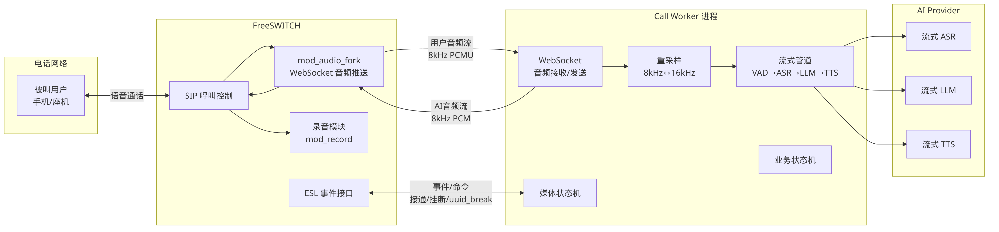
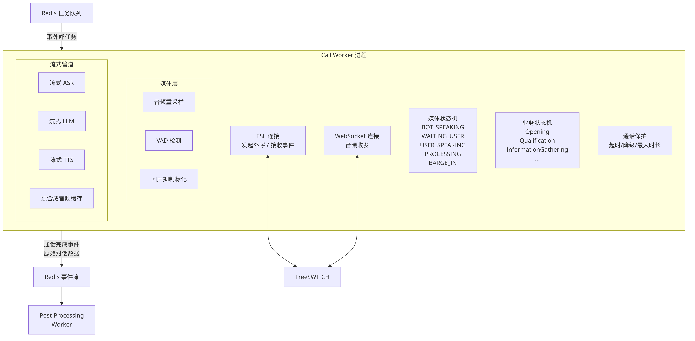

# 04 - 通信与媒体层

---

## 1. FreeSWITCH 在系统中的定位

FreeSWITCH 是整个外呼系统的 **电话呼叫控制中心**，承担以下核心职责：

| 职责 | 说明 |
|------|------|
| SIP 接入与呼叫管理 | 通过 SIP Trunk 连接运营商线路，发起和接收呼叫 |
| 音频输入输出入口 | 所有电话侧音频的唯一进出口 |
| 录音控制节点 | 基于 `mod_record` 进行全程录音 |
| 会话生命周期控制器 | 管理从拨号到挂断的完整通话生命周期 |

### 设计原则

> **FreeSWITCH 从第一阶段就引入，不回避通信复杂度。**

电话通信本身具有协议复杂、编码多样、实时性要求高等特点。我们选择在架构设计之初就将 FreeSWITCH 纳入系统，而非用模拟方案替代。这样做的好处是：

- 早期暴露通信层的延迟、编码、并发等真实问题
- 避免后期从模拟方案迁移到真实电话系统时的架构重构
- 团队从第一天就积累电话系统的运维经验

---

## 2. 媒体桥接路径



媒体桥接是整个系统中最关键的数据通路——它决定了用户的语音如何到达 AI、AI 的回复如何变成电话里的声音。

### 2.1 推荐方案：mod_audio_fork + WebSocket

我们采用 FreeSWITCH 的 `mod_audio_fork` 模块，通过 WebSocket 协议将实时音频流桥接到 Call Worker 进程。

**完整的音频流转路径如下：**

```
被叫用户 (手机/座机)
    │
    │ 语音通话 (G.711 编码)
    ▼
FreeSWITCH
    │
    │ mod_audio_fork (WebSocket 推送)
    │ 音频格式: 8kHz PCMU
    ▼
Call Worker
    │
    ├─→ 重采样: 8kHz PCMU → 16kHz PCM16
    │       │
    │       ▼
    │   流式 ASR (语音识别)
    │       │
    │       ▼
    │   流式 LLM (大模型推理)
    │       │
    │       ▼
    │   流式 TTS (语音合成)
    │       │
    │       ▼
    ├─← 重采样: 16~24kHz PCM16 → 8kHz PCM16
    │
    │ WebSocket 回送
    ▼
FreeSWITCH
    │
    │ 播放 AI 语音
    ▼
被叫用户 (听到 AI 回复)
```

**流程详细说明：**

1. **FreeSWITCH 推送用户音频** —— FreeSWITCH 通过 `mod_audio_fork` 将实时音频流通过 WebSocket 推送到 Call Worker
2. **Call Worker 接收并转换** —— Call Worker 接收音频流，进行格式转换（8kHz PCMU → 16kHz PCM16）
3. **送入流式 ASR** —— 转换后的音频实时送入流式 ASR 引擎进行语音识别
4. **TTS 合成回传** —— TTS 合成的音频在 Call Worker 中转换回 8kHz PCMU
5. **回送播放** —— 通过 WebSocket 回送 FreeSWITCH 播放给用户

### 2.2 音频格式矩阵

系统中不同位置的音频格式各不相同，Call Worker 负责在这些格式之间进行转换：

| 位置 | 格式 | 采样率 | 编码 |
|------|------|--------|------|
| 电话线路 | G.711 | 8kHz | PCMU/PCMA |
| FreeSWITCH 内部 | PCM | 8kHz | Linear16 |
| ASR 输入 | PCM | 16kHz | Linear16 |
| TTS 输出 | PCM | 16-24kHz | Linear16 |
| 回送 FreeSWITCH | PCM | 8kHz | Linear16 |

### 2.3 为什么选择 mod_audio_fork + WebSocket

| 方案 | 优点 | 缺点 |
|------|------|------|
| **mod_audio_fork + WebSocket**（推荐） | 实时性好、双向流、FreeSWITCH 原生支持 | 需要管理 WebSocket 连接状态 |
| mod_shout + HTTP POST | 实现简单 | 单向、延迟高、不适合实时对话 |
| RTP 直连 | 延迟最低 | 实现复杂、需自行处理 RTP 协议 |
| UniMRCP | 标准化 | 过于重量级、灵活性差 |

`mod_audio_fork` 方案在实时性、双向传输能力和实现复杂度之间取得了最佳平衡。

### 2.4 关键延迟指标

媒体桥接路径的端到端延迟直接影响通话体验：

| 环节 | 目标延迟 | 说明 |
|------|----------|------|
| FreeSWITCH → Call Worker | < 20ms | WebSocket 传输 + 缓冲 |
| 音频重采样 | < 5ms | CPU 计算 |
| ASR 识别 | 200-500ms | 取决于语音长度和模型 |
| LLM 首 Token | 200-800ms | 取决于模型和 prompt 复杂度 |
| TTS 首音频块 | 100-300ms | 流式合成 |
| Call Worker → FreeSWITCH | < 20ms | WebSocket 回送 |
| **端到端总延迟** | **< 1.5s** | 用户可接受的响应延迟 |

---

## 3. Call Worker 架构



Call Worker 是系统中负责驱动单通电话的核心进程。它独立于 HTTP 管理面服务运行，专注于实时通话处理。

### 3.1 核心特征

- **独立进程** —— 不在 HTTP 管理面进程内运行，避免 Web 请求与实时音频处理互相干扰
- **任务驱动** —— 从 Redis 队列获取外呼任务，完成后将结果写入 Redis Stream
- **双连接模型** —— 同时维护与 FreeSWITCH 的 ESL 连接（控制信令）和 WebSocket 连接（音频流）
- **可水平扩展** —— 可多实例部署，每实例管理 N 路并发通话

### 3.2 内部组件

Call Worker 内部由三个层次的组件协同工作：

#### 媒体层

```
音频接收 → 重采样(8k→16k) → VAD检测 → 回声抑制标记
                                          │
TTS音频 ← 重采样(16k→8k) ← 流式合成 ←──┘
```

- **音频重采样** —— 在 8kHz（电话侧）和 16kHz（AI 侧）之间转换
- **VAD 检测** —— 检测用户是否正在说话，用于打断判断和静音检测
- **回声抑制标记** —— 当 AI 正在播放语音时，标记该时段的音频以避免 ASR 误识别 AI 自身的声音

#### 流式管道

```
ASR(流式识别) → LLM(流式推理) → TTS(流式合成) → 播放
```

- **流式 ASR** —— 实时将用户语音转为文字
- **流式 LLM** —— 接收 ASR 文本，流式生成回复
- **流式 TTS** —— 将 LLM 输出的文本流式合成为语音
- **预合成音频缓存** —— 对常用话术（如开场白、确认语）预先合成并缓存，减少首次响应延迟

#### 状态管理

Call Worker 内部维护两个独立但协作的状态机：

**媒体状态机（MSM）** —— 管理音频交互的状态：

| 状态 | 含义 | 转换条件 |
|------|------|----------|
| `BOT_SPEAKING` | AI 正在播放语音 | TTS 开始输出 |
| `WAITING_USER` | 等待用户说话 | AI 播放完毕 |
| `USER_SPEAKING` | 用户正在说话 | VAD 检测到人声 |
| `PROCESSING` | AI 正在处理（ASR→LLM→TTS） | 用户停止说话 |
| `BARGE_IN` | 用户打断 AI 说话 | BOT_SPEAKING 期间 VAD 检测到人声 |

**业务状态机（BSM）** —— 管理对话的业务流程：

| 状态 | 含义 |
|------|------|
| `Opening` | 开场白阶段 |
| `Qualification` | 资质确认 |
| `InformationGathering` | 信息收集 |
| `Presentation` | 产品/服务介绍 |
| `ObjectionHandling` | 异议处理 |
| `Closing` | 结束话术 |

BSM 的状态转换由 LLM 根据对话内容判断驱动。

### 3.3 通话保护机制

| 保护项 | 规则 | 动作 |
|--------|------|------|
| 单通最大时长 | 超过 5 分钟 | 播放结束话术后挂断 |
| 用户无响应超时 | 连续 10 秒无语音 | 播放提示语，再无响应则挂断 |
| ASR 连续失败 | 连续 3 次识别为空 | 降级为预录话术 |
| TTS 服务异常 | 合成超时或失败 | 使用预合成缓存或挂断 |
| LLM 响应超时 | 超过 5 秒无输出 | 播放过渡语（如"请稍等"） |

### 3.4 Call Worker 生命周期

```
1. 启动 → 连接 Redis，开始监听任务队列
2. 获取任务 → 从 Redis 队列取出外呼任务
3. 发起呼叫 → 通过 ESL 向 FreeSWITCH 发送 originate 命令
4. 等待接通 → 监听 CHANNEL_ANSWER 事件
5. 建立媒体 → 执行 uuid_audio_fork 开始音频转发，启动 WebSocket 接收
6. 对话循环 → MSM + BSM 驱动完整对话流程
7. 通话结束 → 检测到挂断事件或主动结束
8. 写入结果 → 将通话结果、对话记录写入 Redis Stream
9. 回到步骤 2，获取下一个任务
```

### 3.5 并发模型

```
Call Worker 实例 1 (管理 50 路并发)
    ├── 通话 A (goroutine)
    ├── 通话 B (goroutine)
    ├── ...
    └── 通话 ... (goroutine)

Call Worker 实例 2 (管理 50 路并发)
    ├── 通话 ... (goroutine)
    └── ...
```

每个 Call Worker 实例基于 Go goroutine 运行，每路通话作为一个独立 goroutine。建议每实例管理 **50+ 路并发通话**，根据 CPU 和内存资源调整。

---

## 4. FreeSWITCH 事件处理

Call Worker 通过 **ESL（Event Socket Library）** 连接到 FreeSWITCH，订阅并处理以下关键事件：

### 4.1 核心事件

| 事件 | 含义 | Call Worker 处理 |
|------|------|------------------|
| `CHANNEL_ANSWER` | 被叫接通 | 启动音频 fork，开始对话流程 |
| `CHANNEL_HANGUP` | 通话挂断 | 停止音频处理，清理资源，写入结果 |
| `DTMF` | 按键事件 | 暂不处理（预留扩展） |
| `MEDIA_BUG_START` | 音频 fork 开始 | 确认媒体通道建立 |
| `MEDIA_BUG_STOP` | 音频 fork 停止 | 确认媒体通道关闭 |

### 4.2 挂断原因分类

`CHANNEL_HANGUP` 事件需要区分挂断原因，以便进行正确的后续处理：

| 挂断原因 | Hangup Cause | 处理方式 |
|----------|-------------|----------|
| 用户主动挂断 | `NORMAL_CLEARING` | 正常记录，标记通话完成 |
| 系统主动挂断 | `NORMAL_CLEARING`（由 Call Worker 发起） | 正常记录 |
| 用户忙 | `USER_BUSY` | 标记为"用户忙"，可安排重拨 |
| 无人接听 | `NO_ANSWER` | 标记为"未接"，安排重拨 |
| 号码不存在 | `UNALLOCATED_NUMBER` | 标记为无效号码 |
| 网络错误 | `NETWORK_OUT_OF_ORDER` | 记录错误，系统告警 |

### 4.3 ESL 连接模式

```
Call Worker ──(outbound ESL)──→ FreeSWITCH:8021
```

使用 **Outbound 模式**：Call Worker 主动连接 FreeSWITCH 的 ESL 端口（默认 8021），发送命令并订阅事件。

使用纯 Go 实现的 ESL TCP 客户端，单独 goroutine 读取事件流，通过 channel 分发到各 CallSession goroutine。

---

## 5. 通话控制命令

Call Worker 通过 ESL 向 FreeSWITCH 发送以下控制命令：

### 5.1 核心命令

| 命令 | 用途 | 调用时机 |
|------|------|----------|
| `originate` | 发起外呼 | 获取到外呼任务时 |
| `uuid_audio_fork` | 开始/停止音频流转发 | 通话接通后启动，通话结束时停止 |
| `uuid_break` | 停止当前播放 | 用户打断（barge-in）时 |
| `uuid_record` | 开始/停止录音 | 通话接通后启动，通话结束时停止 |
| `uuid_kill` | 强制结束通话 | 超时或异常情况下强制挂断 |

### 5.2 命令示例

#### 发起外呼

```
originate {origination_caller_id_number=<主叫号码>}sofia/gateway/<网关名>/<被叫号码> &park()
```

- 使用 `&park()` 让通话在接通后暂停，由 Call Worker 接管控制
- `origination_caller_id_number` 设置主叫显示号码

#### 开始音频 fork

```
uuid_audio_fork <uuid> start ws://<call-worker-host>:<port>/audio/<call_id> mono 8000
```

- `mono` 表示单声道
- `8000` 表示采样率 8kHz

#### 停止当前播放（打断）

```
uuid_break <uuid>
```

- 当媒体状态机进入 `BARGE_IN` 状态时发送
- 立即停止 FreeSWITCH 正在播放的音频

#### 开始录音

```
uuid_record <uuid> start /recordings/<call_id>.wav
```

#### 强制结束通话

```
uuid_kill <uuid> NORMAL_CLEARING
```

### 5.3 命令执行的错误处理

| 错误场景 | 处理方式 |
|----------|----------|
| originate 失败 | 记录失败原因，标记任务状态，根据策略决定是否重试 |
| uuid_audio_fork 失败 | 通话无法进行 AI 对话，播放预录语音后挂断 |
| ESL 连接断开 | 尝试重连，通话中的连接断开则标记所有活跃通话为异常 |

---

## 6. 录音管理

### 6.1 录音流程

```
通话接通
    │
    ▼
FreeSWITCH 开始录音 (uuid_record)
    │  录音文件: /recordings/<call_id>.wav
    │
    ▼
通话进行中... (持续录音)
    │
    ▼
通话结束
    │
    ▼
FreeSWITCH 停止录音
    │
    ▼
Call Worker 将通话结果写入 Redis Stream
    │  包含录音文件路径
    │
    ▼
Post-Processing Worker 消费事件
    │
    ├──→ 上传录音到 OSS (对象存储)
    │
    ├──→ 回写 calls 表的 record_url 字段
    │
    └──→ 清理本地录音文件
```

### 6.2 录音配置

| 配置项 | 值 | 说明 |
|--------|-----|------|
| 格式 | WAV (PCM) | 通用格式，便于后续处理 |
| 采样率 | 8kHz | 与电话线路一致 |
| 声道 | 单声道 | 混合用户和 AI 的声音 |
| 存储路径 | `/recordings/<call_id>.wav` | 以 call_id 命名 |

### 6.3 录音存储策略

- **本地临时存储** —— 录音文件先保存在 FreeSWITCH 本地磁盘
- **异步上传** —— 通话结束后由 Post-Processing Worker 异步上传到 OSS
- **数据库回写** —— 上传完成后，将 OSS URL 回写到 `calls` 表的 `record_url` 字段
- **本地清理** —— 上传成功后删除本地文件，失败则保留并重试
- **保留策略** —— 录音文件在 OSS 上保留 90 天（可配置），过期自动清理

---

## 附录：本章关键术语

| 术语 | 全称 | 说明 |
|------|------|------|
| ESL | Event Socket Library | FreeSWITCH 的外部控制接口 |
| SIP | Session Initiation Protocol | 电话呼叫信令协议 |
| PCMU | G.711 mu-law | 北美电话网络常用编码 |
| PCMA | G.711 A-law | 欧洲/中国电话网络常用编码 |
| VAD | Voice Activity Detection | 语音活动检测 |
| ASR | Automatic Speech Recognition | 自动语音识别 |
| TTS | Text-to-Speech | 文本转语音 |
| LLM | Large Language Model | 大语言模型 |
| OSS | Object Storage Service | 对象存储服务 |
| MSM | Media State Machine | 媒体状态机 |
| BSM | Business State Machine | 业务状态机 |
