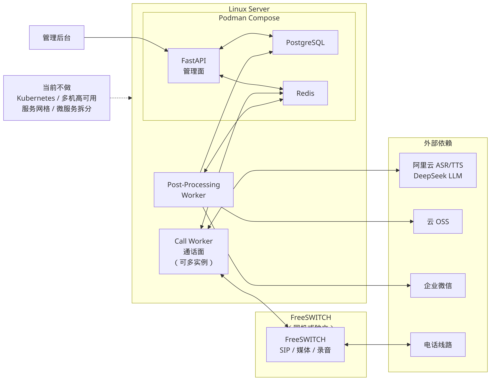
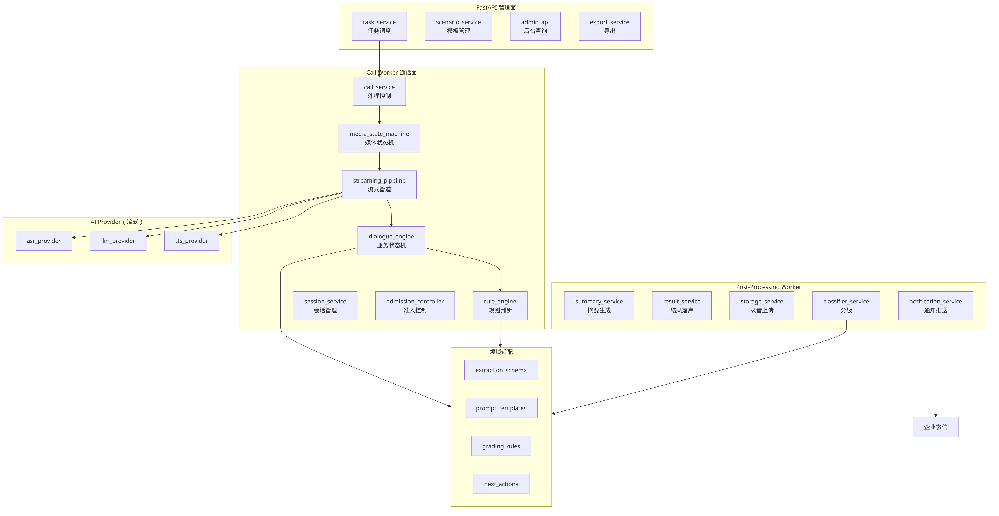

# 07 - 部署与运维

## 1. 技术选型

### 基础技术栈

| 组件 | 选型 | 说明 |
|---|---|---|
| 后端（管理面） | Go (net/http) | 任务管理、模板管理、结果查询 |
| 通话面 | Go (goroutine + channel) | Call Worker，独立进程 |
| 通信 | FreeSWITCH | SIP/呼叫控制，mod_audio_fork |
| 数据库 | PostgreSQL | 核心业务数据 |
| 缓存/队列 | Redis (Stream) | 会话状态、任务队列、事件流 |
| 存储 | OSS / MinIO | 录音、导出、预合成音频 |
| 部署 | 单二进制 + Docker 多阶段构建 | 单机容器化 |
| 通知 | 企业微信机器人 | 人工跟进推送 |

### AI能力栈（MVP）

| 能力 | MVP选型 | 后续可切换 | 理由 |
|---|---|---|---|
| ASR | 阿里云实时语音识别 | FunASR本地 | 原生流式+VAD+端点检测，开箱即用 |
| TTS | 阿里云流式语音合成 | CosyVoice本地 | 原生流式，首包延迟低 |
| LLM | DeepSeek API（SSE流式） | 可插拔 | 低成本，流式支持好 |

### 技术取舍说明

**为什么MVP阶段ASR/TTS用云端API而非开源本地：**

- CosyVoice CPU模式延迟>2秒/句，不满足实时要求，需GPU
- FunASR流式需自建VAD+WebSocket管道，开发量大
- 阿里云ASR/TTS原生支持流式+VAD+端点检测，开箱即用
- 月1000通x60秒成本约100元，远低于GPU服务器月租
- Provider接口抽象已预留切换能力

**为什么 Go：**

- goroutine + channel 天然适合实时音频流水线，无需 async/await 关键字污染
- 单二进制部署，Docker 镜像 < 30MB
- 编译期类型安全，接口检查在编译时完成
- 内置 pprof/trace 性能分析，内置 testing/benchmark 框架
- 无 GIL，真正的多核并行处理

**为什么FreeSWITCH现在就上：**

- 外呼系统核心是通话控制，FreeSWITCH是事实标准
- mod_audio_fork支持实时音频流转发，与ASR/TTS流式管道天然匹配
- 延迟引入会导致后期架构返工，不如一步到位
- 社区成熟，文档充分，问题可搜索

**为什么LLM用DeepSeek：**

- 中文能力强，性价比极高（百万token成本约1元）
- 支持SSE流式输出，首字延迟低
- Provider接口抽象后可一键切换到其他模型

**为什么要scenario_templates：**

- 外呼场景差异大（催收、回访、通知、营销），硬编码不可维护
- 模板化后新场景只需配置，不需改代码
- 模板包含：prompt模板、提取schema、分级规则、后续动作
- 为后续可视化编排工具打基础

---

## 2. 部署架构



> Mermaid 源文件：[diagrams/07-01-deployment.mmd](./diagrams/07-01-deployment.mmd)

### 单机部署方案（三类进程）

整体部署在 **1台Linux服务器** 上，进程分为三类：

**容器化服务（Podman Compose）：**

- Clarion API Server (Go)
- PostgreSQL
- Redis

**独立进程：**

- **Call Worker（通话面）**：独立 Go 二进制，可启动多个实例以支撑并发通话
- **Post-Processing Worker（后处理）**：独立 Go 二进制，消费Redis Stream中的通话完成事件

**通信服务：**

- FreeSWITCH：可与主机同机部署，也可独立部署

**外部依赖：**

- 阿里云ASR/TTS API
- DeepSeek LLM API
- 云OSS（录音存储）
- 企业微信（通知推送）

### 当前阶段不做

- Kubernetes
- 多机高可用
- 服务网格
- 微服务拆分

> 单人维护阶段，复杂度是最大敌人。单机方案足以支撑MVP验证。

---

## 3. 模块划分



> Mermaid 源文件：[diagrams/07-02-modules.mmd](./diagrams/07-02-modules.mmd)

### 管理面模块（HTTP Server 进程）

| 模块 | 职责 |
|---|---|
| task_service | 任务调度：创建外呼任务、分配号码、控制节奏 |
| scenario_service | 场景模板管理：CRUD、版本控制、模板验证 |
| admin_api | 后台查询接口：任务列表、通话详情、统计报表 |
| export_service | 导出服务：通话记录导出、报表生成 |

### 通话面模块（Call Worker进程）

| 模块 | 职责 |
|---|---|
| call_service | 外呼控制：发起呼叫、挂断、状态跟踪 |
| media_state_machine | 媒体状态机：管理通话媒体层状态流转 |
| streaming_pipeline | 流式管道：VAD→ASR→LLM→TTS全链路流式处理 |
| dialogue_engine | 业务状态机与对话驱动：场景流程控制、轮次管理 |
| rule_engine | 规则判断：意图识别后的业务规则匹配与决策 |
| session_service | 会话状态管理：Redis读写、上下文维护 |
| admission_controller | 准入控制：并发限制、频率控制、黑名单检查 |

### 后处理模块（Post-Processing Worker）

| 模块 | 职责 |
|---|---|
| summary_service | 摘要生成：通话结束后调用LLM生成结构化摘要 |
| result_service | 结果落库：将通话结果、提取信息写入PostgreSQL |
| storage_service | 录音上传：将本地录音文件上传至OSS |
| notification_service | 通知推送：通过企业微信机器人推送人工跟进提醒 |
| classifier_service | 分级处理：根据规则对通话结果进行分级标注 |

### AI服务接口模块（共享）

三个进程均可调用的AI能力抽象层：

| 模块 | 接口模式 | 说明 |
|---|---|---|
| asr_provider | 流式接口 | 音频流→文本流，支持VAD事件回调 |
| llm_provider | 流式接口 | prompt→token流（SSE），支持function calling |
| tts_provider | 流式接口 | 文本→音频流，支持首包推送 |

每个 provider 定义统一的 Go interface，底层实现可切换（云端API ↔ 本地模型），切换时只需更换实现，不影响上层逻辑。

### 领域适配模块（共享）

场景模板的运行时解析与匹配：

| 模块 | 职责 |
|---|---|
| extraction_schema_manager | 管理信息提取的字段定义与校验规则 |
| prompt_template_manager | 管理各场景阶段的LLM prompt模板 |
| grading_rule_manager | 管理通话结果分级规则的加载与匹配 |
| next_action_manager | 管理通话后续动作的决策规则 |

---

## 4. 成本度量方法

### 已知成本项

| 成本项 | 计费方式 | 备注 |
|---|---|---|
| 服务器 | 月租 | 单机Linux，按配置计费 |
| 域名 | 年费 | 管理后台访问 |
| 通信测试 | 按通话时长 | SIP线路费用 |
| DeepSeek API | 按token计费 | input/output分别计价 |
| 阿里云ASR | 按识别时长计费 | 实时语音识别 |
| 阿里云TTS | 按合成字符数计费 | 流式语音合成 |
| 录音存储 | 按存储量+流量计费 | OSS存储 |

### 度量方法

**单通通话计量数据采集：**

每通通话完成后，在 `calls` 表或 `call_events` 中记录以下计量数据：

```
- asr_duration_ms:     ASR调用总时长（毫秒）
- llm_input_tokens:    LLM输入token数
- llm_output_tokens:   LLM输出token数
- tts_characters:      TTS合成字符数
- call_duration_ms:    通话总时长（毫秒）
- provider_calls:      各provider调用次数
```

**月度汇总与分析：**

- 按月汇总各项成本，计算单通均价
- 与本地部署方案成本对比（GPU服务器月租 + 电费 + 维护工时）
- 跟踪成本趋势，识别异常波动

**本地部署切换决策：**

- 设定盈亏平衡阈值：预估月 **2000-5000通** 为云端/本地成本交叉点
- 当月通话量稳定超过阈值时，启动本地ASR/TTS部署评估
- 决策依据：`月云端API成本 > 月GPU服务器成本 + 迁移工时分摊`

---

## 5. 合规与风险控制

### 通话策略要求

| 要求 | 说明 |
|---|---|
| 开场说明身份 | 通话开始必须表明来电方身份和来意 |
| 拒绝时立即结束 | 用户明确拒绝后，不再继续推销，礼貌结束通话 |
| 支持黑名单 | 维护不可拨打号码列表，admission_controller在拨打前检查 |
| 不重复骚扰 | 同一号码在指定时间窗口内不重复拨打 |

### 数据处理要求

| 要求 | 实现方式 |
|---|---|
| 手机号脱敏 | 日志和展示层手机号中间四位替换为 `****` |
| 哈希去重 | 号码导入时哈希去重，防止重复录入 |
| 权限控制 | API层面基于角色的访问控制 |
| 操作日志 | 关键操作（任务创建、号码导入、手动拨打）记录审计日志 |

### 风险与应对

| 风险 | 影响 | 应对策略 |
|---|---|---|
| FreeSWITCH联调复杂 | 阻塞开发进度 | 先做最小链路，文本模拟模式加速对话调试 |
| 云端ASR/TTS延迟波动 | 通话体验下降 | 预合成音频缓存+降级策略：常用话术预合成，超时时播放缓存音频 |
| LLM回复偏离预期 | 通话失控 | 状态机+规则引擎约束，LLM只做参考；关键节点使用模板话术 |
| DeepSeek API超时/限流 | 通话卡顿 | 填充话术+模板回复降级链：超时→播放"请稍等"→使用模板回复 |
| 重复外呼/通知 | 用户投诉 | 幂等key+去重锁+唯一约束，确保同一任务同一号码不重复触发 |
| 单人维护复杂度 | 迭代缓慢 | 三进程分离降低耦合，文本模拟模式加速迭代，减少联调依赖 |

---

## 6. 文本模拟调试模式

### 设计目标

绕过 FreeSWITCH / ASR / TTS，直接以文本方式驱动对话引擎，用于快速调试：

- 状态机流转逻辑
- 规则引擎匹配
- LLM prompt效果
- 信息提取准确度
- 分级规则正确性

### 工作原理

```
正常通话链路：
  电话 → FreeSWITCH → 音频流 → ASR → 文本 → dialogue_engine → 文本 → TTS → 音频流 → FreeSWITCH → 电话

文本模拟链路：
  CLI/Web输入 → 文本 → dialogue_engine → 文本 → CLI/Web输出
```

### 实现方式

- **CLI模式**：命令行交互，输入用户话术，输出系统回复+状态变化
- **简单Web界面**：聊天窗口形式，左右分栏显示对话和内部状态

### 调试信息输出

每轮对话输出以下调试信息：

```
[轮次 3]
  用户输入: "我现在不方便"
  意图识别: BUSY
  当前状态: GREETING → OBJECTION_HANDLING
  规则匹配: rule_busy_reschedule
  LLM prompt: (展示实际发送的prompt)
  LLM回复: "好的，理解您现在不方便，请问什么时候方便接听呢？"
  提取信息: {available_time: null}
  下一步动作: WAIT_FOR_INPUT
```

### 开发阶段

**第一阶段即提供**，与核心对话引擎同步开发。文本模拟模式是对话逻辑开发的主要调试手段，不依赖FreeSWITCH环境即可验证大部分业务逻辑。

---

## 7. 后续演进方向

### AI服务演进

```
当前：云端API（阿里云ASR/TTS + DeepSeek LLM）
  ↓ 当通话量达到盈亏平衡点
目标：本地部署（FunASR + CosyVoice + 本地LLM）
```

- 通过provider接口抽象实现无缝切换
- 本地部署需评估：GPU配置、模型精度、运维成本

### 通信线路演进

```
当前：测试线路（验证链路通畅）
  ↓
目标：正式商用线路（稳定性、资费、号码资源）
```

### 业务能力演进

- 更精细的分级体系：从简单三级扩展到多维度评分
- 更完整的人工闭环：人工跟进结果回写、效果分析
- 实时转接能力：通话中通过 `uuid_bridge` 转接至人工坐席
### 领域扩展

- 通用对话引擎 + 场景模板库
- 新场景上线只需配置模板，不需改代码
- 可视化流程编排工具：拖拽式定义对话流程和分支逻辑
### 工程化演进

- **日志体系**：结构化日志、链路追踪（trace_id贯穿全链路）
- **监控告警**：通话成功率、ASR/TTS延迟、LLM响应时间
- **部署隔离**：开发/测试/生产环境分离
- **自动化测试**：基于文本模拟模式的回归测试套件
- **性能分析**：内置 pprof endpoint，运行时 CPU/内存/goroutine 分析
- **配置统一**：单一 TOML 配置文件，告别 INI/YAML 混用
